#### CGAN
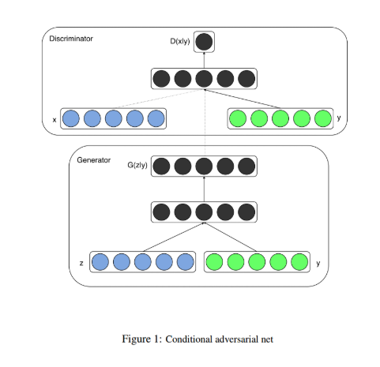

#### some samples of images and labels

|sample1|sample2|sample3|sample4|sample5|
|---|---|---|---|---|
|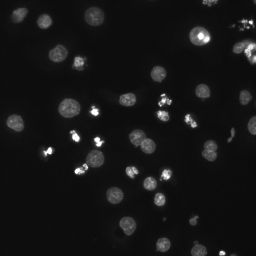|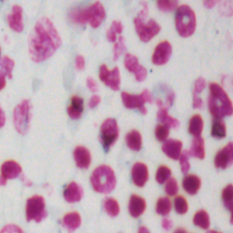|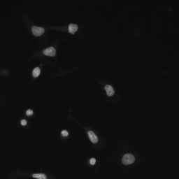|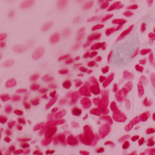|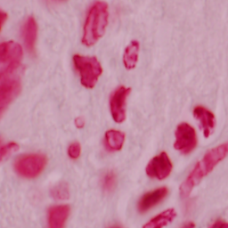|
|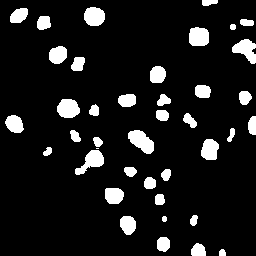|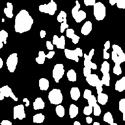|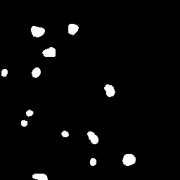|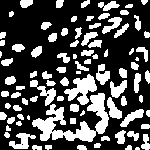|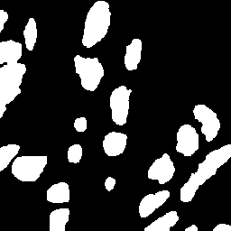|

#### Implementation process
`step 1 -> python train.py`

`step 2 -> python evaluate.py`
